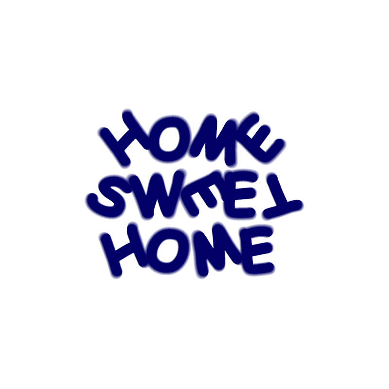
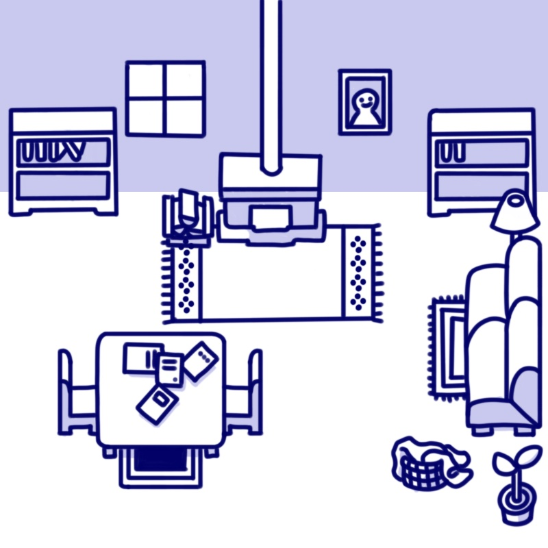

# Home Sweet Home [^1]

Welcome to Home Sweet Home!

Home Sweet Home is a 2-player cooperative game made using the [p5party↗](https://p5party.org/) library.

 

## Instructions
You and your roommate are given a list of tasks to work together to complete. Use your mouse to wipe the windows, clean the table, care for the plant, and sort the cupboard to check things off the list together and get the place looking brand new!

### [Play here↗](https://rogec540.github.io/GameB/src/index.html)
 

## Visuals

 

## External Assets

## Font

- Typeface: Comic Sans MS
  - designed by Vincent Connare 1994
  - Version 2.10
  - Copyright: © 2018 Microsoft Corporation. All Rights Reserved.

## Team Members

**Charlotte Rogers** Available on Github @ [charogerz↗](https://github.com/charogerz)\
**Chloe Yiu** Available on Github @ [yiuchl↗](https://github.com/yiuchl)\
**Emma Wu** Available on Github @ [ewwamu↗](https://github.com/ewwamu)\
**Sophie Jiang**

 

[^1]: _Made for Spring 2024 Collab: P5 Party by Charlotte Rogers, Chloe Yiu, Sophie Jiang, and Emma Wu_
